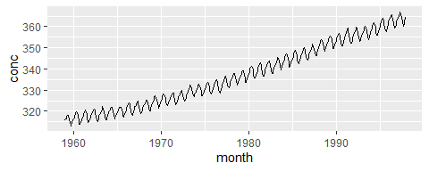
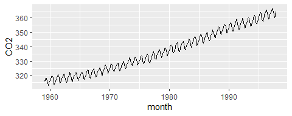
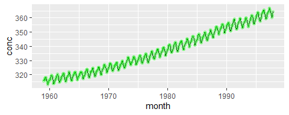
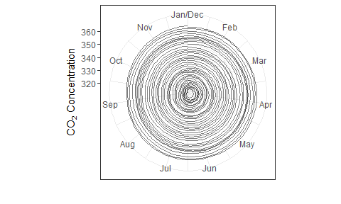

## Preliminary

Begin by loading the required packages. If you don't have these installed (or don't know whether you have them installed), you can install them by executing the following code in your console:

```
install.packages("tidyverse")
install.packages("scales")
install.packages("tsibble")
```

Now run this code chunk to load the packages:


```r
suppressPackageStartupMessages(library(tidyverse))
suppressPackageStartupMessages(library(gapminder))
suppressPackageStartupMessages(library(scales))
suppressPackageStartupMessages(library(tsibble))
knitr::opts_chunk$set(fig.align = "center")
```

<!---The following chunk allows errors when knitting--->


## Exercise 1: Bar Chart Grammar (Together)

Consider the following plot. Don't concern yourself with the code at this point.


```r
gapminder %>% 
  filter(year == 2007) %>% 
  mutate(continent = fct_infreq(continent)) %>% 
  ggplot(aes(continent)) +
  geom_bar() +
  theme_bw()
```


Fill in the seven grammar components for this plot.

| Grammar Component     | Specification |
|-----------------------|---------------|
| __data__              | `gapminder` |
| __aesthetic mapping__ | x: continent, y: count |
| __geometric object__  | bar |
| scale                 | linear |
| statistical transform | count |
| coordinate system     | rectangular |
| facetting             | no |

## Exercise 2: `ggplot2` Syntax (Your Turn)

The following is a tsibble (a special type of tibble containing time series data, which we'll see more of later), stored in the variable `mauna`, of CO$_2$ concentrations collected monthly at the Mauna Loa station.
Execute this code to store the data in `mauna`:

```r
(mauna <- tsibble::as_tsibble(co2) %>% 
   rename(month = index, conc = value))
```

```
## # A tsibble: 468 x 2 [1M]
##       month  conc
##       <mth> <dbl>
##  1 1959 Jan  315.
##  2 1959 Feb  316.
##  3 1959 Mar  316.
##  4 1959 Apr  318.
##  5 1959 May  318.
##  6 1959 Jun  318 
##  7 1959 Jul  316.
##  8 1959 Aug  315.
##  9 1959 Sep  314.
## 10 1959 Oct  313.
## # ... with 458 more rows
```
### 2(a)
Produce a line chart showing the concentration over time. Specifically, the plot should have the following grammar components:
| Grammar Component     | Specification |
|-----------------------|---------------|
| __data__              | `mauna` |
| __aesthetic mapping__ | x: month, y: conc |
| __geometric object__  | lines |
| scale                 | linear |
| statistical transform | none |
| coordinate system     | rectangular |
| facetting             | none |

Fill in the blanks to obtain the plot:


```r
(p <- ggplot(mauna, aes(month, conc)) +
  geom_line())
```



### 2(b)

It turns out that you're allowed to specify the aesthetic mappings in a `geom` layer instead of, or in addition to, in the `ggplot()` function, with the following rules:

- Aesthetics appearing in a `geom` layer apply only to that layer.
- If there are conflicting aesthetics in both the `ggplot()` function and the `geom` layer, the `geom` layer takes precedence.

The following code mistakenly puts the month variable on the y-axis. Fill in the `FILL_THIS_IN` so that you still obtain the same result as above.


```r
ggplot(mauna, aes(y = month)) +
  geom_line(aes(month, conc)) +
  ylab("CO2")
```



### 2(c)

You can store the output of the plot in a variable, too. Store the plot from 2(a) in the variable named `p`, then add a layer to `p` that adds green points to the plot.


```r
p +
  geom_point(colour = "green", alpha = 0.2)
```



### 2(d)

What's wrong with the following code? Fix it.


```r
ggplot(gapminder) +
  geom_point(aes(x = gdpPercap, y = lifeExp), alpha = 0.1)
```


### 2(e) BONUS

So you're a ggplot2 pro? Then, let's see this plot adapted to polar coordinates. Specifically:

- angle is month (January through December)
- radius is CO$_2$ concentration
The plot should look like a spiral, or concentric circles. 

```r
suppressPackageStartupMessages(library(lubridate))
ggplot(mauna, aes(month(month), conc)) +
  geom_line(aes(group = year(month)), alpha = 0.5) +
  coord_polar() +
  scale_x_continuous(breaks = 1:12, 
                     labels = month.abb) +
  labs(x = "", 
       y = expression(paste(CO[2], " Concentration"))) +
  theme_bw()
```


