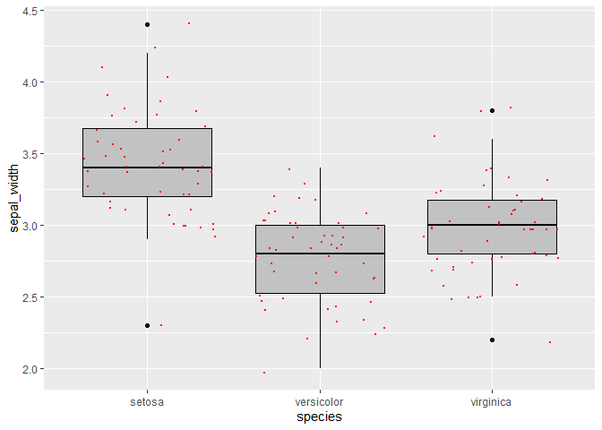
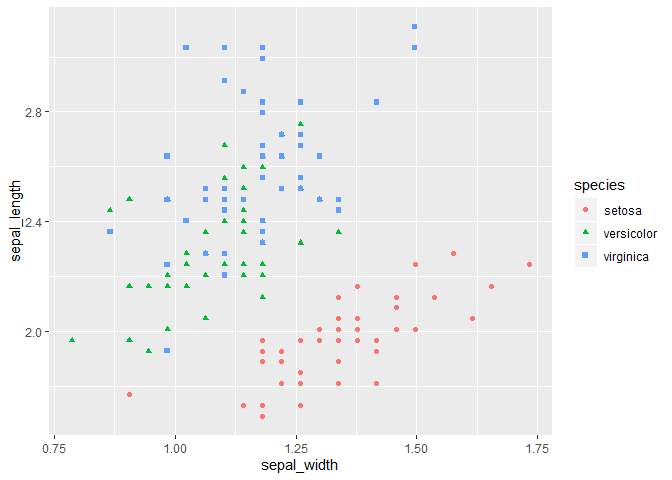
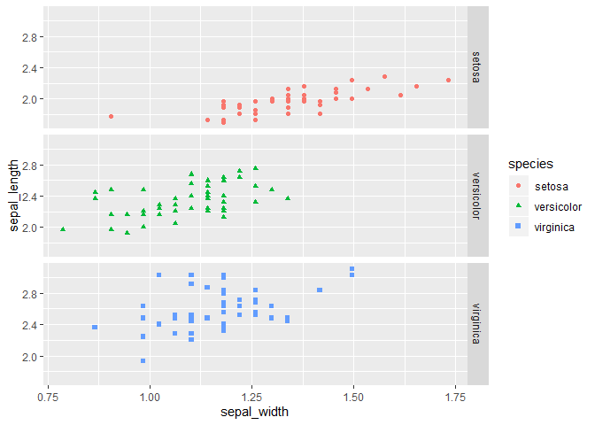

<!---The following chunk allows errors when knitting--->


**When you make an Rmd file for participation or homework, be sure to do this**:

1. Change the file output to both html and md _documents_ (not notebook).
  - See the `keep_md: TRUE` argument above.

2. `knit` the document. 

3. Stage and commit the Rmd and knitted documents.


# Let's review some `dplyr` syntax

Load the `tidyverse` package.
    

```r
# load your packages here:
library(tidyverse)
```
    

## `select()`, `rename()`, `filter()`, `mutate()`, and a little plotting

Let's use the `mtcars` dataset. Complete the following tasks. Chain together
all of the commands in a task using the pipe `%>%`.

1. Show the miles per gallon and horsepower for cars with 6 cylinders. Also
   convert the data frame to a tibble (keep the rownames and store them in the
   tibble with a descriptive variable name). Store this result as a new object
   with a descriptive object name.


```r
mtcars_filtered <- mtcars %>% 
  as_tibble(rownames = "model") %>% 
  filter(cyl == 6) %>% 
  select(model, mpg, hp)

mtcars_filtered
```

```
## # A tibble: 7 x 3
##   model            mpg    hp
##   <chr>          <dbl> <dbl>
## 1 Mazda RX4       21     110
## 2 Mazda RX4 Wag   21     110
## 3 Hornet 4 Drive  21.4   110
## 4 Valiant         18.1   105
## 5 Merc 280        19.2   123
## 6 Merc 280C       17.8   123
## 7 Ferrari Dino    19.7   175
```

2. Print the results from Task 1 in an appealing way by using `knitr::kable()`.


```r
knitr::kable(mtcars_filtered)
```


model              mpg    hp
---------------  -----  ----
Mazda RX4         21.0   110
Mazda RX4 Wag     21.0   110
Hornet 4 Drive    21.4   110
Valiant           18.1   105
Merc 280          19.2   123
Merc 280C         17.8   123
Ferrari Dino      19.7   175

Let's use the `iris` dataset. Complete the following tasks. Chain together
all of the commands in a task using the pipe `%>%`.

3. Rename the variables to be all lowercase and to separate words with "_"
   instead of ".". Put the species name variable first. Store this result as 
   a new object.


```r
summary(iris)
```

```
##   Sepal.Length    Sepal.Width     Petal.Length    Petal.Width   
##  Min.   :4.300   Min.   :2.000   Min.   :1.000   Min.   :0.100  
##  1st Qu.:5.100   1st Qu.:2.800   1st Qu.:1.600   1st Qu.:0.300  
##  Median :5.800   Median :3.000   Median :4.350   Median :1.300  
##  Mean   :5.843   Mean   :3.057   Mean   :3.758   Mean   :1.199  
##  3rd Qu.:6.400   3rd Qu.:3.300   3rd Qu.:5.100   3rd Qu.:1.800  
##  Max.   :7.900   Max.   :4.400   Max.   :6.900   Max.   :2.500  
##        Species  
##  setosa    :50  
##  versicolor:50  
##  virginica :50  
##                 
##                 
## 
```

```r
cleaned_iris <- iris %>% 
  rename_all(tolower) %>% 
  rename(sepal_length = sepal.length, sepal_width = sepal.width, petal_length = petal.length, petal_width = petal.width) %>% 
  select(species, everything())

knitr::kable(cleaned_iris)
```


species       sepal_length   sepal_width   petal_length   petal_width
-----------  -------------  ------------  -------------  ------------
setosa                 5.1           3.5            1.4           0.2
setosa                 4.9           3.0            1.4           0.2
setosa                 4.7           3.2            1.3           0.2
setosa                 4.6           3.1            1.5           0.2
setosa                 5.0           3.6            1.4           0.2
setosa                 5.4           3.9            1.7           0.4
setosa                 4.6           3.4            1.4           0.3
setosa                 5.0           3.4            1.5           0.2
setosa                 4.4           2.9            1.4           0.2
setosa                 4.9           3.1            1.5           0.1
setosa                 5.4           3.7            1.5           0.2
setosa                 4.8           3.4            1.6           0.2
setosa                 4.8           3.0            1.4           0.1
setosa                 4.3           3.0            1.1           0.1
setosa                 5.8           4.0            1.2           0.2
setosa                 5.7           4.4            1.5           0.4
setosa                 5.4           3.9            1.3           0.4
setosa                 5.1           3.5            1.4           0.3
setosa                 5.7           3.8            1.7           0.3
setosa                 5.1           3.8            1.5           0.3
setosa                 5.4           3.4            1.7           0.2
setosa                 5.1           3.7            1.5           0.4
setosa                 4.6           3.6            1.0           0.2
setosa                 5.1           3.3            1.7           0.5
setosa                 4.8           3.4            1.9           0.2
setosa                 5.0           3.0            1.6           0.2
setosa                 5.0           3.4            1.6           0.4
setosa                 5.2           3.5            1.5           0.2
setosa                 5.2           3.4            1.4           0.2
setosa                 4.7           3.2            1.6           0.2
setosa                 4.8           3.1            1.6           0.2
setosa                 5.4           3.4            1.5           0.4
setosa                 5.2           4.1            1.5           0.1
setosa                 5.5           4.2            1.4           0.2
setosa                 4.9           3.1            1.5           0.2
setosa                 5.0           3.2            1.2           0.2
setosa                 5.5           3.5            1.3           0.2
setosa                 4.9           3.6            1.4           0.1
setosa                 4.4           3.0            1.3           0.2
setosa                 5.1           3.4            1.5           0.2
setosa                 5.0           3.5            1.3           0.3
setosa                 4.5           2.3            1.3           0.3
setosa                 4.4           3.2            1.3           0.2
setosa                 5.0           3.5            1.6           0.6
setosa                 5.1           3.8            1.9           0.4
setosa                 4.8           3.0            1.4           0.3
setosa                 5.1           3.8            1.6           0.2
setosa                 4.6           3.2            1.4           0.2
setosa                 5.3           3.7            1.5           0.2
setosa                 5.0           3.3            1.4           0.2
versicolor             7.0           3.2            4.7           1.4
versicolor             6.4           3.2            4.5           1.5
versicolor             6.9           3.1            4.9           1.5
versicolor             5.5           2.3            4.0           1.3
versicolor             6.5           2.8            4.6           1.5
versicolor             5.7           2.8            4.5           1.3
versicolor             6.3           3.3            4.7           1.6
versicolor             4.9           2.4            3.3           1.0
versicolor             6.6           2.9            4.6           1.3
versicolor             5.2           2.7            3.9           1.4
versicolor             5.0           2.0            3.5           1.0
versicolor             5.9           3.0            4.2           1.5
versicolor             6.0           2.2            4.0           1.0
versicolor             6.1           2.9            4.7           1.4
versicolor             5.6           2.9            3.6           1.3
versicolor             6.7           3.1            4.4           1.4
versicolor             5.6           3.0            4.5           1.5
versicolor             5.8           2.7            4.1           1.0
versicolor             6.2           2.2            4.5           1.5
versicolor             5.6           2.5            3.9           1.1
versicolor             5.9           3.2            4.8           1.8
versicolor             6.1           2.8            4.0           1.3
versicolor             6.3           2.5            4.9           1.5
versicolor             6.1           2.8            4.7           1.2
versicolor             6.4           2.9            4.3           1.3
versicolor             6.6           3.0            4.4           1.4
versicolor             6.8           2.8            4.8           1.4
versicolor             6.7           3.0            5.0           1.7
versicolor             6.0           2.9            4.5           1.5
versicolor             5.7           2.6            3.5           1.0
versicolor             5.5           2.4            3.8           1.1
versicolor             5.5           2.4            3.7           1.0
versicolor             5.8           2.7            3.9           1.2
versicolor             6.0           2.7            5.1           1.6
versicolor             5.4           3.0            4.5           1.5
versicolor             6.0           3.4            4.5           1.6
versicolor             6.7           3.1            4.7           1.5
versicolor             6.3           2.3            4.4           1.3
versicolor             5.6           3.0            4.1           1.3
versicolor             5.5           2.5            4.0           1.3
versicolor             5.5           2.6            4.4           1.2
versicolor             6.1           3.0            4.6           1.4
versicolor             5.8           2.6            4.0           1.2
versicolor             5.0           2.3            3.3           1.0
versicolor             5.6           2.7            4.2           1.3
versicolor             5.7           3.0            4.2           1.2
versicolor             5.7           2.9            4.2           1.3
versicolor             6.2           2.9            4.3           1.3
versicolor             5.1           2.5            3.0           1.1
versicolor             5.7           2.8            4.1           1.3
virginica              6.3           3.3            6.0           2.5
virginica              5.8           2.7            5.1           1.9
virginica              7.1           3.0            5.9           2.1
virginica              6.3           2.9            5.6           1.8
virginica              6.5           3.0            5.8           2.2
virginica              7.6           3.0            6.6           2.1
virginica              4.9           2.5            4.5           1.7
virginica              7.3           2.9            6.3           1.8
virginica              6.7           2.5            5.8           1.8
virginica              7.2           3.6            6.1           2.5
virginica              6.5           3.2            5.1           2.0
virginica              6.4           2.7            5.3           1.9
virginica              6.8           3.0            5.5           2.1
virginica              5.7           2.5            5.0           2.0
virginica              5.8           2.8            5.1           2.4
virginica              6.4           3.2            5.3           2.3
virginica              6.5           3.0            5.5           1.8
virginica              7.7           3.8            6.7           2.2
virginica              7.7           2.6            6.9           2.3
virginica              6.0           2.2            5.0           1.5
virginica              6.9           3.2            5.7           2.3
virginica              5.6           2.8            4.9           2.0
virginica              7.7           2.8            6.7           2.0
virginica              6.3           2.7            4.9           1.8
virginica              6.7           3.3            5.7           2.1
virginica              7.2           3.2            6.0           1.8
virginica              6.2           2.8            4.8           1.8
virginica              6.1           3.0            4.9           1.8
virginica              6.4           2.8            5.6           2.1
virginica              7.2           3.0            5.8           1.6
virginica              7.4           2.8            6.1           1.9
virginica              7.9           3.8            6.4           2.0
virginica              6.4           2.8            5.6           2.2
virginica              6.3           2.8            5.1           1.5
virginica              6.1           2.6            5.6           1.4
virginica              7.7           3.0            6.1           2.3
virginica              6.3           3.4            5.6           2.4
virginica              6.4           3.1            5.5           1.8
virginica              6.0           3.0            4.8           1.8
virginica              6.9           3.1            5.4           2.1
virginica              6.7           3.1            5.6           2.4
virginica              6.9           3.1            5.1           2.3
virginica              5.8           2.7            5.1           1.9
virginica              6.8           3.2            5.9           2.3
virginica              6.7           3.3            5.7           2.5
virginica              6.7           3.0            5.2           2.3
virginica              6.3           2.5            5.0           1.9
virginica              6.5           3.0            5.2           2.0
virginica              6.2           3.4            5.4           2.3
virginica              5.9           3.0            5.1           1.8

4. Using the data from Task 3, plot the sepal width for each species. Perhaps 
   use a boxplot or a jitter plot (or both overlaid!). Be sure to format the
   axis labels nicely.


```r
  ggplot(cleaned_iris, aes(species, sepal_width)) + 
  geom_boxplot(color = "black", fill = "grey", alpha = 0.9) +
  geom_jitter(color = "red", size = 0.4, alpha = 0.9)
```

<!-- -->

5. `iris` expresses all of the measurements in centimeters. Convert them to 
   inches (1 in = 2.54 cm). Store this dataset as a new object.


```r
iris_inches <- cleaned_iris %>% 
  mutate(sepal_length = sepal_length / 2.54,
         sepal_width = sepal_width / 2.54,
         petal_length = petal_length / 2.54,
         petal_width = petal_width / 2.54) %>% 
  print()
```

```
##        species sepal_length sepal_width petal_length petal_width
## 1       setosa     2.007874   1.3779528    0.5511811  0.07874016
## 2       setosa     1.929134   1.1811024    0.5511811  0.07874016
## 3       setosa     1.850394   1.2598425    0.5118110  0.07874016
## 4       setosa     1.811024   1.2204724    0.5905512  0.07874016
## 5       setosa     1.968504   1.4173228    0.5511811  0.07874016
## 6       setosa     2.125984   1.5354331    0.6692913  0.15748031
## 7       setosa     1.811024   1.3385827    0.5511811  0.11811024
## 8       setosa     1.968504   1.3385827    0.5905512  0.07874016
## 9       setosa     1.732283   1.1417323    0.5511811  0.07874016
## 10      setosa     1.929134   1.2204724    0.5905512  0.03937008
## 11      setosa     2.125984   1.4566929    0.5905512  0.07874016
## 12      setosa     1.889764   1.3385827    0.6299213  0.07874016
## 13      setosa     1.889764   1.1811024    0.5511811  0.03937008
## 14      setosa     1.692913   1.1811024    0.4330709  0.03937008
## 15      setosa     2.283465   1.5748031    0.4724409  0.07874016
## 16      setosa     2.244094   1.7322835    0.5905512  0.15748031
## 17      setosa     2.125984   1.5354331    0.5118110  0.15748031
## 18      setosa     2.007874   1.3779528    0.5511811  0.11811024
## 19      setosa     2.244094   1.4960630    0.6692913  0.11811024
## 20      setosa     2.007874   1.4960630    0.5905512  0.11811024
## 21      setosa     2.125984   1.3385827    0.6692913  0.07874016
## 22      setosa     2.007874   1.4566929    0.5905512  0.15748031
## 23      setosa     1.811024   1.4173228    0.3937008  0.07874016
## 24      setosa     2.007874   1.2992126    0.6692913  0.19685039
## 25      setosa     1.889764   1.3385827    0.7480315  0.07874016
## 26      setosa     1.968504   1.1811024    0.6299213  0.07874016
## 27      setosa     1.968504   1.3385827    0.6299213  0.15748031
## 28      setosa     2.047244   1.3779528    0.5905512  0.07874016
## 29      setosa     2.047244   1.3385827    0.5511811  0.07874016
## 30      setosa     1.850394   1.2598425    0.6299213  0.07874016
## 31      setosa     1.889764   1.2204724    0.6299213  0.07874016
## 32      setosa     2.125984   1.3385827    0.5905512  0.15748031
## 33      setosa     2.047244   1.6141732    0.5905512  0.03937008
## 34      setosa     2.165354   1.6535433    0.5511811  0.07874016
## 35      setosa     1.929134   1.2204724    0.5905512  0.07874016
## 36      setosa     1.968504   1.2598425    0.4724409  0.07874016
## 37      setosa     2.165354   1.3779528    0.5118110  0.07874016
## 38      setosa     1.929134   1.4173228    0.5511811  0.03937008
## 39      setosa     1.732283   1.1811024    0.5118110  0.07874016
## 40      setosa     2.007874   1.3385827    0.5905512  0.07874016
## 41      setosa     1.968504   1.3779528    0.5118110  0.11811024
## 42      setosa     1.771654   0.9055118    0.5118110  0.11811024
## 43      setosa     1.732283   1.2598425    0.5118110  0.07874016
## 44      setosa     1.968504   1.3779528    0.6299213  0.23622047
## 45      setosa     2.007874   1.4960630    0.7480315  0.15748031
## 46      setosa     1.889764   1.1811024    0.5511811  0.11811024
## 47      setosa     2.007874   1.4960630    0.6299213  0.07874016
## 48      setosa     1.811024   1.2598425    0.5511811  0.07874016
## 49      setosa     2.086614   1.4566929    0.5905512  0.07874016
## 50      setosa     1.968504   1.2992126    0.5511811  0.07874016
## 51  versicolor     2.755906   1.2598425    1.8503937  0.55118110
## 52  versicolor     2.519685   1.2598425    1.7716535  0.59055118
## 53  versicolor     2.716535   1.2204724    1.9291339  0.59055118
## 54  versicolor     2.165354   0.9055118    1.5748031  0.51181102
## 55  versicolor     2.559055   1.1023622    1.8110236  0.59055118
## 56  versicolor     2.244094   1.1023622    1.7716535  0.51181102
## 57  versicolor     2.480315   1.2992126    1.8503937  0.62992126
## 58  versicolor     1.929134   0.9448819    1.2992126  0.39370079
## 59  versicolor     2.598425   1.1417323    1.8110236  0.51181102
## 60  versicolor     2.047244   1.0629921    1.5354331  0.55118110
## 61  versicolor     1.968504   0.7874016    1.3779528  0.39370079
## 62  versicolor     2.322835   1.1811024    1.6535433  0.59055118
## 63  versicolor     2.362205   0.8661417    1.5748031  0.39370079
## 64  versicolor     2.401575   1.1417323    1.8503937  0.55118110
## 65  versicolor     2.204724   1.1417323    1.4173228  0.51181102
## 66  versicolor     2.637795   1.2204724    1.7322835  0.55118110
## 67  versicolor     2.204724   1.1811024    1.7716535  0.59055118
## 68  versicolor     2.283465   1.0629921    1.6141732  0.39370079
## 69  versicolor     2.440945   0.8661417    1.7716535  0.59055118
## 70  versicolor     2.204724   0.9842520    1.5354331  0.43307087
## 71  versicolor     2.322835   1.2598425    1.8897638  0.70866142
## 72  versicolor     2.401575   1.1023622    1.5748031  0.51181102
## 73  versicolor     2.480315   0.9842520    1.9291339  0.59055118
## 74  versicolor     2.401575   1.1023622    1.8503937  0.47244094
## 75  versicolor     2.519685   1.1417323    1.6929134  0.51181102
## 76  versicolor     2.598425   1.1811024    1.7322835  0.55118110
## 77  versicolor     2.677165   1.1023622    1.8897638  0.55118110
## 78  versicolor     2.637795   1.1811024    1.9685039  0.66929134
## 79  versicolor     2.362205   1.1417323    1.7716535  0.59055118
## 80  versicolor     2.244094   1.0236220    1.3779528  0.39370079
## 81  versicolor     2.165354   0.9448819    1.4960630  0.43307087
## 82  versicolor     2.165354   0.9448819    1.4566929  0.39370079
## 83  versicolor     2.283465   1.0629921    1.5354331  0.47244094
## 84  versicolor     2.362205   1.0629921    2.0078740  0.62992126
## 85  versicolor     2.125984   1.1811024    1.7716535  0.59055118
## 86  versicolor     2.362205   1.3385827    1.7716535  0.62992126
## 87  versicolor     2.637795   1.2204724    1.8503937  0.59055118
## 88  versicolor     2.480315   0.9055118    1.7322835  0.51181102
## 89  versicolor     2.204724   1.1811024    1.6141732  0.51181102
## 90  versicolor     2.165354   0.9842520    1.5748031  0.51181102
## 91  versicolor     2.165354   1.0236220    1.7322835  0.47244094
## 92  versicolor     2.401575   1.1811024    1.8110236  0.55118110
## 93  versicolor     2.283465   1.0236220    1.5748031  0.47244094
## 94  versicolor     1.968504   0.9055118    1.2992126  0.39370079
## 95  versicolor     2.204724   1.0629921    1.6535433  0.51181102
## 96  versicolor     2.244094   1.1811024    1.6535433  0.47244094
## 97  versicolor     2.244094   1.1417323    1.6535433  0.51181102
## 98  versicolor     2.440945   1.1417323    1.6929134  0.51181102
## 99  versicolor     2.007874   0.9842520    1.1811024  0.43307087
## 100 versicolor     2.244094   1.1023622    1.6141732  0.51181102
## 101  virginica     2.480315   1.2992126    2.3622047  0.98425197
## 102  virginica     2.283465   1.0629921    2.0078740  0.74803150
## 103  virginica     2.795276   1.1811024    2.3228346  0.82677165
## 104  virginica     2.480315   1.1417323    2.2047244  0.70866142
## 105  virginica     2.559055   1.1811024    2.2834646  0.86614173
## 106  virginica     2.992126   1.1811024    2.5984252  0.82677165
## 107  virginica     1.929134   0.9842520    1.7716535  0.66929134
## 108  virginica     2.874016   1.1417323    2.4803150  0.70866142
## 109  virginica     2.637795   0.9842520    2.2834646  0.70866142
## 110  virginica     2.834646   1.4173228    2.4015748  0.98425197
## 111  virginica     2.559055   1.2598425    2.0078740  0.78740157
## 112  virginica     2.519685   1.0629921    2.0866142  0.74803150
## 113  virginica     2.677165   1.1811024    2.1653543  0.82677165
## 114  virginica     2.244094   0.9842520    1.9685039  0.78740157
## 115  virginica     2.283465   1.1023622    2.0078740  0.94488189
## 116  virginica     2.519685   1.2598425    2.0866142  0.90551181
## 117  virginica     2.559055   1.1811024    2.1653543  0.70866142
## 118  virginica     3.031496   1.4960630    2.6377953  0.86614173
## 119  virginica     3.031496   1.0236220    2.7165354  0.90551181
## 120  virginica     2.362205   0.8661417    1.9685039  0.59055118
## 121  virginica     2.716535   1.2598425    2.2440945  0.90551181
## 122  virginica     2.204724   1.1023622    1.9291339  0.78740157
## 123  virginica     3.031496   1.1023622    2.6377953  0.78740157
## 124  virginica     2.480315   1.0629921    1.9291339  0.70866142
## 125  virginica     2.637795   1.2992126    2.2440945  0.82677165
## 126  virginica     2.834646   1.2598425    2.3622047  0.70866142
## 127  virginica     2.440945   1.1023622    1.8897638  0.70866142
## 128  virginica     2.401575   1.1811024    1.9291339  0.70866142
## 129  virginica     2.519685   1.1023622    2.2047244  0.82677165
## 130  virginica     2.834646   1.1811024    2.2834646  0.62992126
## 131  virginica     2.913386   1.1023622    2.4015748  0.74803150
## 132  virginica     3.110236   1.4960630    2.5196850  0.78740157
## 133  virginica     2.519685   1.1023622    2.2047244  0.86614173
## 134  virginica     2.480315   1.1023622    2.0078740  0.59055118
## 135  virginica     2.401575   1.0236220    2.2047244  0.55118110
## 136  virginica     3.031496   1.1811024    2.4015748  0.90551181
## 137  virginica     2.480315   1.3385827    2.2047244  0.94488189
## 138  virginica     2.519685   1.2204724    2.1653543  0.70866142
## 139  virginica     2.362205   1.1811024    1.8897638  0.70866142
## 140  virginica     2.716535   1.2204724    2.1259843  0.82677165
## 141  virginica     2.637795   1.2204724    2.2047244  0.94488189
## 142  virginica     2.716535   1.2204724    2.0078740  0.90551181
## 143  virginica     2.283465   1.0629921    2.0078740  0.74803150
## 144  virginica     2.677165   1.2598425    2.3228346  0.90551181
## 145  virginica     2.637795   1.2992126    2.2440945  0.98425197
## 146  virginica     2.637795   1.1811024    2.0472441  0.90551181
## 147  virginica     2.480315   0.9842520    1.9685039  0.74803150
## 148  virginica     2.559055   1.1811024    2.0472441  0.78740157
## 149  virginica     2.440945   1.3385827    2.1259843  0.90551181
## 150  virginica     2.322835   1.1811024    2.0078740  0.70866142
```

6. Using the data from Task 5, plot the relationship between sepal width and
   sepal length. Indicate species using color and point shape.


```r
iris_inches %>% 
  ggplot(aes(sepal_width, sepal_length)) +
  geom_point(aes(color = species, shape = species))
```

<!-- -->

7. Using the data from Task 5, plot the relationship between sepal width and
   sepal length. This time, separate each species into a different subplot 
   (facet).


```r
iris_inches %>% 
  ggplot(aes(sepal_width, sepal_length)) +
  geom_point(aes(color = species, shape = species)) +
  facet_grid(rows = vars(species))
```

<!-- -->


# Back to Guide Again

Let's head back to the guide at the section on `summarize()`.


# Exercises for grouped data frames

Let's do some practice with grouping (and ungrouping) and summarizing data frames!

1. (a) What's the minimum life expectancy for each continent and each year? 
   (b) Add the corresponding country to the tibble, too. 
   (c) Arrange by min life expectancy.


```r
gapminder %>% 
  group_by(FILL_THIS_IN) %>% 
  FILL_THIS_IN(min_life = min(lifeExp))
```

```
## Error in eval(lhs, parent, parent): object 'gapminder' not found
```


2. Let's compute the mean Agreeableness score across items for each participant 
in the `psych::bfi` dataset. Be sure to handle `NA`!


```r
psych::bfi %>%
  as_tibble() %>% 
  select(A1:A5) %>% 
  rowwise() %>% 
  mutate(A_mean = mean(c(A1, A2, A3, A4, A5), na.rm = TRUE)) %>% 
  ungroup()
```

```
## # A tibble: 2,800 x 6
##       A1    A2    A3    A4    A5 A_mean
##    <int> <int> <int> <int> <int>  <dbl>
##  1     2     4     3     4     4    3.4
##  2     2     4     5     2     5    3.6
##  3     5     4     5     4     4    4.4
##  4     4     4     6     5     5    4.8
##  5     2     3     3     4     5    3.4
##  6     6     6     5     6     5    5.6
##  7     2     5     5     3     5    4  
##  8     4     3     1     5     1    2.8
##  9     4     3     6     3     3    3.8
## 10     2     5     6     6     5    4.8
## # ... with 2,790 more rows
```

Now compute mean scores for Conscientiousness, as well as `sd` and `min` scores 
for reach person.


Some functions are **vectorized**, so you don't need `rowwise()`. 
For example, `pmin()` computes the "parallel min" across the vectors it receives:


```r
psych::bfi %>% 
  as_tibble() %>% 
  select(A1:A5) %>% 
  mutate(A_min = pmin(A1, A2, A3, A4, A5))
```

```
## # A tibble: 2,800 x 6
##       A1    A2    A3    A4    A5 A_min
##    <int> <int> <int> <int> <int> <int>
##  1     2     4     3     4     4     2
##  2     2     4     5     2     5     2
##  3     5     4     5     4     4     4
##  4     4     4     6     5     5     4
##  5     2     3     3     4     5     2
##  6     6     6     5     6     5     5
##  7     2     5     5     3     5     2
##  8     4     3     1     5     1     1
##  9     4     3     6     3     3     3
## 10     2     5     6     6     5     2
## # ... with 2,790 more rows
```

**There are a few other ways to do this sort of computation.**

`rowMeans()` computes the mean of each row of a data frame. We can use it by
putting `select()` inside of `mutate()`:


```r
psych::bfi %>% 
  as_tibble() %>% 
  select(A1:A5) %>% 
  mutate(A_mn = rowMeans(select(., A1:A5)),
         A_mn2 = rowMeans(select(., starts_with("A", ignore.case = FALSE))))
```

```
## # A tibble: 2,800 x 7
##       A1    A2    A3    A4    A5  A_mn A_mn2
##    <int> <int> <int> <int> <int> <dbl> <dbl>
##  1     2     4     3     4     4   3.4   3.4
##  2     2     4     5     2     5   3.6   3.6
##  3     5     4     5     4     4   4.4   4.4
##  4     4     4     6     5     5   4.8   4.8
##  5     2     3     3     4     5   3.4   3.4
##  6     6     6     5     6     5   5.6   5.6
##  7     2     5     5     3     5   4     4  
##  8     4     3     1     5     1   2.8   2.8
##  9     4     3     6     3     3   3.8   3.8
## 10     2     5     6     6     5   4.8   4.8
## # ... with 2,790 more rows
```

**In the development version of `dplyr`, there are some functions to make**
**this approach easier.**

```
remotes::install_github("tidyverse/dplyr")
```


```r
psych::bfi %>% 
  as_tibble() %>% 
  select(A1:A5) %>% 
  mutate(A_mn = rowMeans(across(A1:A5)),
         A_mn2 = rowMeans(across(starts_with("A", ignore.case = FALSE))))
```

3. Let's use `psych::bfi` and make a new data frame that has
   (1) each participant's educational level (convert it to a categorical variable
   using `factor*()`) and the mean score for each of the Big Five scales for each 
   participant. Store this data frame as a new object.
   

```r
FILL_THIS_IN <-
  psych::bfi %>% 
  FILL_THIS_IN(FILL_THIS_IN)
```

```
## Error in FILL_THIS_IN(., FILL_THIS_IN): could not find function "FILL_THIS_IN"
```

4. Use the data from Task 3 to summarize the distributions of Big Five scores 
   for each educational level (e.g., report the mean, sd, min, and max for
   each score in each group). Also report the sample size within each group.
   

```r
FILL_THIS_IN %>% 
  FILL_THIS_IN(FILL_THIS_IN) %>% 
  FILL_THIS_IN(FILL_THIS_IN)
```

```
## Error in eval(lhs, parent, parent): object 'FILL_THIS_IN' not found
```


# Bonus Exercises

1. In `gapminder`, take all countries in Europe that have a GDP per capita 
   greater than 10000, and select all variables except `gdpPercap`. 
   (Hint: use `-`).

2. Take the first three columns of `gapminder` and extract the names.

3. In `gapminder`, convert the population to a number in billions.

4. Take the `iris` data frame and extract all columns that start with 
   the word "Petal". 
    - Hint: take a look at the "Select helpers" documentation by running the 
      following code: `?tidyselect::select_helpers`.

5. Filter the rows of `iris` for Sepal.Length >= 4.6 and Petal.Width >= 0.5.

6. Calculate the growth in population since the first year on record 
_for each country_ by rearranging the following lines, and filling in the 
`FILL_THIS_IN`. Here's another convenience function for you: `dplyr::first()`. 

```
mutate(rel_growth = FILL_THIS_IN) %>% 
arrange(FILL_THIS_IN) %>% 
gapminder %>% 
knitr::kable()
group_by(country) %>% 
```


7. Determine the country, on each continent, that experienced the 
**sharpest 5-year drop in life expectancy**, sorted by the drop, by rearranging 
the following lines of code. Ensure there are no `NA`'s. A helpful function to 
compute changes in a variable across rows of data (e.g., for time-series data) 
is `tsibble::difference()`:

```
drop_na() %>% 
ungroup() %>% 
arrange(year) %>% 
filter(inc_life_exp == min(inc_life_exp)) %>% 
gapminder %>% 
mutate(inc_life_exp = FILL_THIS_IN) %>% # Compute the changes in life expectancy
arrange(inc_life_exp) %>% 
group_by(country) %>% 
group_by(continent) %>% 
knitr::kable()
```


Exercises 4. and 5. are from 
[r-exercises](https://www.r-exercises.com/2017/10/19/dplyr-basic-functions-exercises/).
